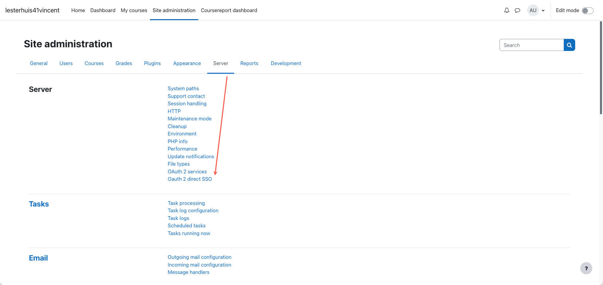
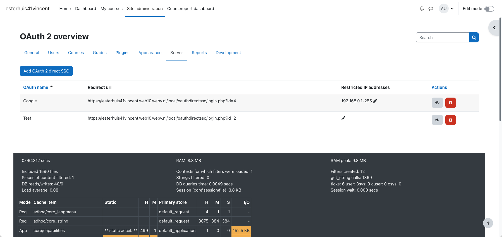
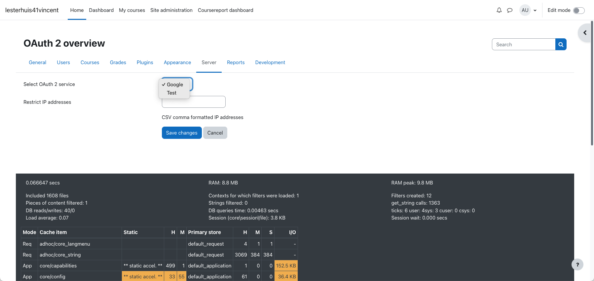

## local_oauthdirectsso

In brief, the Ldesign `local_oauthdirectsso` redirects not logged users to a specific OAuth 2 login url.
 
Special thanks to Gemma Lesterhuis ([Lesterhuis Training & Consultancy](https://ltnc.nl/)) for develop & design, useful input, bug reports and beta testing

* Author: Luuk Verhoeven, [ldesignmedia.nl](https://ldesignmedia.nl/)
* Author: Gemma Lesterhuis, [Lesterhuis Training & Consultancy](https://ltnc.nl/)
* Min. required: Moodle 3.9.x
* Supports PHP: 7.4 trough 8.2

## List of features
- Overview and settings can be found under the 'Server' tab in admin settings (Oauth 2 direct SSO).
- GDPR provider
- Separate login page `/local/oauthdirectsso/login.php?id=x` where `x` will be replaced with the linked OAuth service id
- Redirect can be passed by adding `&wantsurl=https://moodle.lms.nl/course/view.php?id=1`
- IP restrictions can be set for each OAuth provider.
    - This goes to the Moodle core `address_in_subnet()` function specifications:
      - 1: `xxx.xxx.xxx.xxx/nn` or `xxxx:xxxx:xxxx:xxxx:xxxx:xxxx:xxxx/nnn`          (number of bits in net mask)
      - 2: `xxx.xxx.xxx.xxx-yyy` or  `xxxx:xxxx:xxxx:xxxx:xxxx:xxxx:xxxx::xxxx-yyyy` (a range of IP addresses in the last group)
      - 3: `xxx.xxx or xxx.xxx.` or `xxx:xxx:xxxx` or `xxx:xxx:xxxx.`                (incomplete address, a bit non-technical ;-)

## Installation
1.  Copy this plugin to the `local\oauthdirectsso` folder on the server
2.  Login as administrator
3.  Go to Site Administrator > Notification
4.  Install the plugin

## Security

If you discover any security related issues, please email [servicedesk@ltnc.nl](mailto:servicedesk@ltnc.nl) instead of using the issue tracker.

## License

Freeware -  Please see https://ltnc.nl/ltnc-plugin-freeware-licentie for more information.
